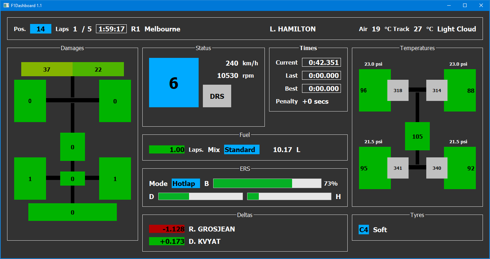

# F1_Dashboard
Display F1 2019 information in a dashborad on a second monitor

## References

- Thibaud Rabillard PXG F1 Telemetry: https://bitbucket.org/Fiingon/pxg-f1-telemetry/src/master/
- Telemetry Data: https://f1-2019-telemetry.readthedocs.io/en/latest/telemetry-specification.html#packet-types

Icons made by <a href="https://www.flaticon.com/authors/freepik" title="Freepik">Freepik</a> from <a href="https://www.flaticon.com/" title="Flaticon">www.flaticon.com</a>

## Compilation

- Download and install Qt 5.13.0 or higher from www.qt.io
- Open "f1_dashboardpro" with Qt creator and compile the project

## Deployment

### macOS
- Add a custom build step in Qt Creator:
 - Command: $QTDIR/bin/macdeployqt
 - Arguments: src/PXG\ F1\ Telemetry.app 
  
### Windows
- Add a custom build step in Qt Creator:
 - Command: %QTDIR%/bin/windeployqt.exe
 - Arguments: "src\release\F1Dashboard.exe" --dir package
- Copy "F1Dashboard.exe" in the package directory

## Author
Denis Forveille (titou10.titou10@gmail.com)

## Screenshots

